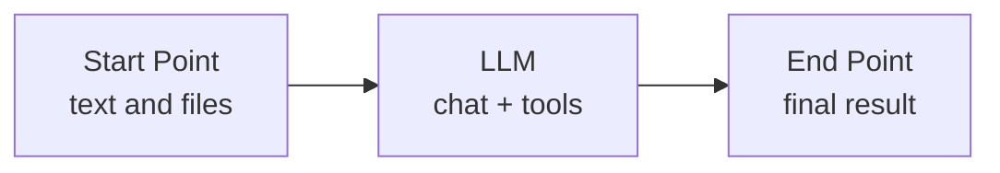
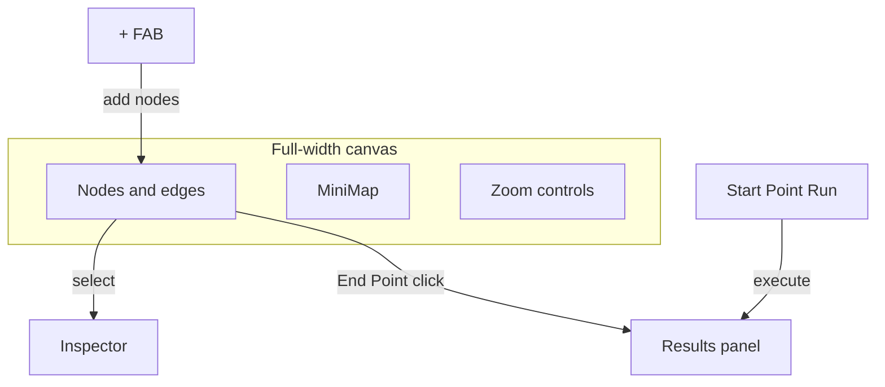

<h1 align="center">
  
  Operate AI
</h1>

<p align="center">
  A visual editor for easily building AI agents and LLM workflows.
  <br />
  An open space for any agentic flow you envision.
</p>

<p align="center">
  
</p>

## Download

- **Editor:** clone this repo and run from source ([Run from source](#run-from-source)).
- **Open Space:** browse shared workflows at [Open Space](https://stamp-floyd-usual-letter.trycloudflare.com/).

## How it works

Workflows are graphs. Execution follows edges (disabled edges are skipped).



| Node | Role |
|------|------|
| **Start Point** | Text and attachments (`.docx`, `.pdf`, images, …) |
| **LLM** | Model call, receives original input + upstream output |
| **End Point** | Displays the final result |



- **+**: add Start Point, LLM, or End Point nodes
- **Start Point**: run the workflow from the node card (play/stop)
- **Results panel**: live progress, final output, collapsible node logs
- **Inspectors**: properties next to the selected node or edge

Locally, the Next.js editor talks to a FastAPI executor (SSE/REST). Models can run on your machine (Ollama) or via cloud providers.

## What it can do

- Build agentic flows on a visual canvas
- Run workflows with streaming progress and per-node logs
- Attach documents and images at Start Point
- Use tools from LLM nodes: **web search**, **generate image**, **run Python**
- Share workflows on **Open Space** (publish with Google sign-in)
- **Open as new**: import a community post into your local editor as a private workflow
- **Star**: save a copy for **Add (+) → Starred** so you can paste into an open canvas
- Point local editors at a public Open Space host for browse / publish / import

## Bring your own model

On the **home page**, open **Keys**:

- **Providers**: store OpenAI / Anthropic / Gemini API keys once for this machine
- **Ollama**: list installed models, **Pull** new ones, **Delete** unused ones (requires Ollama running)
- **Forge**: default image checkpoint for `generate_image` (requires Forge with `--api`)
- **Per-node override**: in an LLM (or loop checker) inspector, save a different key for that node only, test the connection, or clear the override

LLM nodes pick a **provider + model**. Tools work with Ollama and OpenAI. Cursor is not supported (no public chat API for third-party apps).

## Privacy

- Provider keys live in `apps/api/data/secrets.json` (gitignored). They are never written into workflow JSON or Open Space posts.
- Editing and running stay on **your machine** by default.
- **Publishing** to Open Space shares a workflow snapshot **including system prompts**. Large file attachments are stripped.
- Delete on Open Space is creator-only (Google sign-in).

## Run from source

**Prerequisites:** Node 18+, pnpm, Python 3.11+, [Ollama](https://ollama.com)

```bash
pnpm install
pnpm build:schema

cp .env.example .env
cp apps/web/.env.example apps/web/.env.local
```

```bash
# Ollama (Docker)
docker compose up -d ollama
docker exec -it operate-ai-ollama ollama pull gemma4:e4b

# API + web (separate terminals)
pnpm dev:api
pnpm dev:web
```

Open [http://localhost:3000](http://localhost:3000) → **New Workflow** → edit nodes → **Run from Start Point**.

### Scripts

```bash
pnpm dev:web        # :3000
pnpm dev:api        # :8000
pnpm build:schema   # Shared TS types
pnpm build:web      # Production build
```

### Environment

| Variable | Default | Purpose |
|----------|---------|---------|
| `OLLAMA_BASE_URL` | `http://localhost:11434` | Ollama API |
| `FORGE_BASE_URL` | `http://127.0.0.1:7860` | Stable Diffusion WebUI Forge (A1111 `--api`) for `generate_image` |
| `FORGE_DEFAULT_CHECKPOINT` | _(empty)_ | Fallback checkpoint when none saved in Keys → Forge |
| `PYTHON_TOOL_TIMEOUT_SECONDS` | `30` | Max runtime for `run_python` (capped at 120) |
| `NEXT_PUBLIC_API_URL` | `/backend` | Web → local FastAPI proxy (`:8000`) |
| `NEXT_PUBLIC_COMMUNITY_API_URL` | `/community-backend` | Open Space API (local proxy or public `https://…/community-backend`) |
| `NEXT_PUBLIC_OPEN_SPACE_URL` | _(empty)_ | Public Open Space site; when set, local UI opens that host |
| `NEXT_PUBLIC_LOCAL_EDITOR_URL` | `http://localhost:3000` | Target for public “Open as new” / “Star in editor” |
| `NEXT_PUBLIC_GOOGLE_CLIENT_ID` / `GOOGLE_CLIENT_ID` | _(empty)_ | Google OAuth for publish/delete |
| `DATABASE_URL` | _(empty)_ | Postgres URL for public Open Space; empty = local SQLite |
| `CORS_ORIGINS` | _(empty)_ | Extra allowed CORS origins (comma-separated) |
| `COMMUNITY_PUBLISH_RATE_LIMIT` | `10` | Max community publishes per window |
| `COMMUNITY_PUBLISH_RATE_WINDOW_SECONDS` | `3600` | Rate-limit window (seconds) |

Public Open Space deploy (Postgres + Docker + Nginx): see [`deploy/DEPLOY.md`](deploy/DEPLOY.md).  
HTTP endpoints: see [`apps/api/API.md`](apps/api/API.md).

## Repository layout

```
operate-ai/
├── apps/web/                 # Visual editor
├── apps/api/                 # Execution & persistence
├── packages/workflow-schema/ # Shared workflow types
├── deploy/                   # Public Open Space Nginx + env + guide
├── docker-compose.yml        # Local Ollama
└── docker-compose.open-space.yml  # Public Postgres + API + Web + Nginx
```

## Stack

| Layer | Tech |
|-------|------|
| Frontend | Next.js, React Flow, Zustand, Tailwind |
| Backend | FastAPI, httpx |
| LLM | Ollama, OpenAI, Anthropic, Gemini |
| Shared types | `packages/workflow-schema` |
