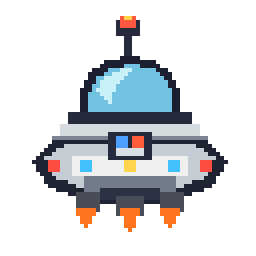
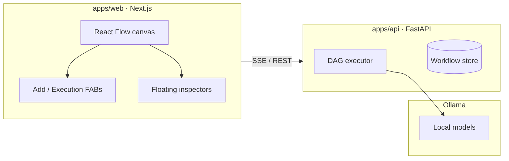
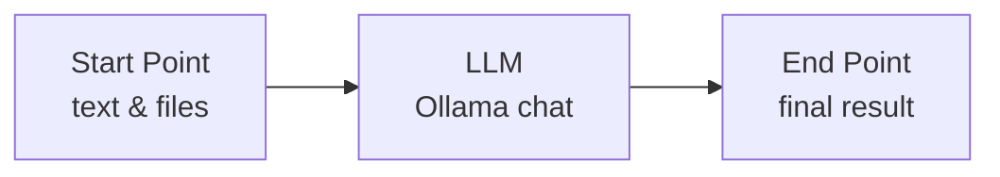
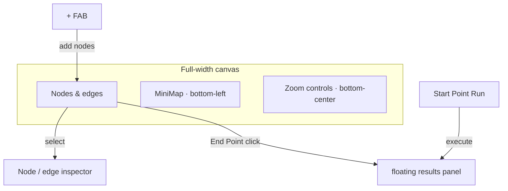

<h1 align="center">
  
  Operate AI
</h1>

<p align="center">
  A visual editor for easily building AI agents and LLM workflows.
  <br> An open space for any agentic flow you envision.
</p>

<p align="center">
  
</p>

## Overview



## Workflow model



| Node | Role |
|------|------|
| **Start Point** | Text and attachments (`.docx`, `.pdf`, images, …) |
| **LLM** | Ollama call — receives original input + upstream output |
| **End Point** | Displays the final result |

Execution order follows the graph (disabled edges are skipped).

## Editor



- **+** — add Start Point, LLM, or End Point nodes  
- **Start Point** — run workflow from the node card (play/stop)  
- **Results panel** — live progress, final output, collapsible node logs (click End Point to reopen)  
- **Inspectors** — properties appear next to the selected node or edge  

## Quick start

**Prerequisites:** Node 18+, pnpm, Python 3.11+, [Ollama](https://ollama.com)

```bash
pnpm install
pnpm build:schema

cp .env.example .env
cp apps/web/.env.example apps/web/.env.local
```

```bash
# Ollama (Docker)
docker compose up -d ollama
docker exec -it operate-ai-ollama ollama pull gemma4:e4b

# API + web (separate terminals)
pnpm dev:api
pnpm dev:web
```

Open [http://localhost:3000](http://localhost:3000) → **New Workflow** → edit nodes → **Run from Start Point**.

### Models & providers

On the **home page**, open **Keys**:

- **Providers** — store OpenAI / Anthropic / Gemini API keys once for this machine (`apps/api/data/secrets.json`, gitignored). Keys apply to all workflows and are never written into workflow JSON or Open Space posts.
- **Ollama** — list installed models, **Pull** new ones, **Delete** unused ones (requires Ollama running).
- **Forge** — pick the default image checkpoint for `generate_image` (requires Forge with `--api`).
- **Per-node override** — in an LLM (or loop checker) node inspector, you can save a different key for that node only, test the connection, or clear the override to fall back to the global key.

LLM nodes pick a **provider + model**. Tools (**web search**, **generate image**, **run Python**) work with Ollama and OpenAI. Cursor is not supported (no public chat API for third-party apps).

| Variable | Default | Purpose |
|----------|---------|---------|
| `OLLAMA_BASE_URL` | `http://localhost:11434` | Ollama API |
| `FORGE_BASE_URL` | `http://127.0.0.1:7860` | Stable Diffusion WebUI Forge (A1111 `--api`) for `generate_image` |
| `FORGE_DEFAULT_CHECKPOINT` | _(empty)_ | Fallback checkpoint when none saved in Keys → Forge |
| `PYTHON_TOOL_TIMEOUT_SECONDS` | `30` | Max runtime for `run_python` (capped at 120) |
| `NEXT_PUBLIC_API_URL` | `/backend` | Web → local FastAPI proxy (`:8000`) |
| `NEXT_PUBLIC_COMMUNITY_API_URL` | `/community-backend` | Open Space API (local proxy or public `https://…/community-backend`) |
| `NEXT_PUBLIC_LOCAL_EDITOR_URL` | `http://localhost:3000` | Target for public “Open as new” |
| `NEXT_PUBLIC_GOOGLE_CLIENT_ID` / `GOOGLE_CLIENT_ID` | _(empty)_ | Google OAuth for publish/delete |
| `DATABASE_URL` | _(empty)_ | Postgres URL for public Open Space; empty = local SQLite |
| `CORS_ORIGINS` | _(empty)_ | Extra allowed CORS origins (comma-separated) |
| `COMMUNITY_PUBLISH_RATE_LIMIT` | `10` | Max community publishes per window |
| `COMMUNITY_PUBLISH_RATE_WINDOW_SECONDS` | `3600` | Rate-limit window (seconds) |

Public Open Space deploy (Postgres + Docker + Nginx): see [`deploy/DEPLOY.md`](deploy/DEPLOY.md).

Browse and share workflows in **Open Space** (`/community` or `/open-space`): publish requires Google sign-in; delete is creator-only. “Open as new” sends the workflow to the local editor import route.

## Stack

| Layer | Tech |
|-------|------|
| Frontend | Next.js, React Flow, Zustand, Tailwind |
| Backend | FastAPI, httpx |
| LLM | Ollama, OpenAI, Anthropic, Gemini |
| Shared types | `packages/workflow-schema` |

## Repo layout

```
operate-ai/
├── apps/web/                 # Visual editor
├── apps/api/                 # Execution & persistence
├── packages/workflow-schema/ # Shared workflow types
├── deploy/                   # Public Open Space Nginx + env + guide
├── docker-compose.yml        # Local Ollama
└── docker-compose.open-space.yml  # Public Postgres + API + Web + Nginx
```

## Scripts

```bash
pnpm dev:web        # :3000
pnpm dev:api        # :8000
pnpm build:schema   # Shared TS types
pnpm build:web      # Production build
```

## API (summary)

| Method | Path | Description |
|--------|------|-------------|
| `POST` | `/execute/stream` | Run workflow (SSE progress) |
| `POST` | `/execute` | Run workflow (JSON) |
| `GET` | `/models` | List Ollama models |
| `GET` | `/models/catalog` | Providers + models catalog |
| `GET` | `/forge/models` | List Forge checkpoints |
| `GET/PUT` | `/settings/forge` | Default Forge checkpoint |
| `GET/PUT` | `/settings/providers` | Cloud API key status / update |
| `POST` | `/settings/providers/test` | Test a provider connection |
| `POST` | `/ollama/pull` | Pull Ollama model (SSE) |
| `DELETE` | `/ollama/models/{name}` | Delete Ollama model |
| `GET/POST` | `/workflows` | List / save workflows |
| `GET/DELETE` | `/workflows/{id}` | Get / delete workflow |
| `GET` | `/community` | List community posts (`q`, `tag`, `sort`) |
| `GET` | `/community/{id}` | Community post detail + workflow snapshot |
| `POST` | `/community` | Publish (Bearer Google ID token) |
| `POST` | `/community/{id}/fork` | Fork into a private workflow |
| `DELETE` | `/community/{id}` | Delete post (Bearer; creator only) |
