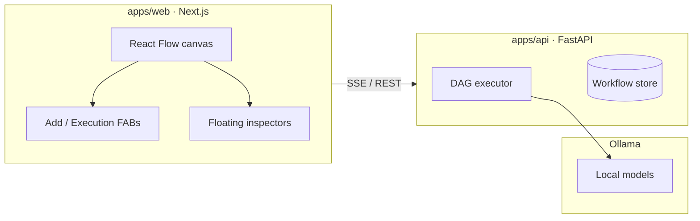
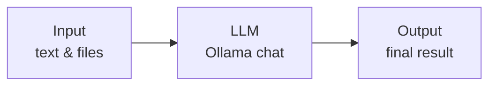
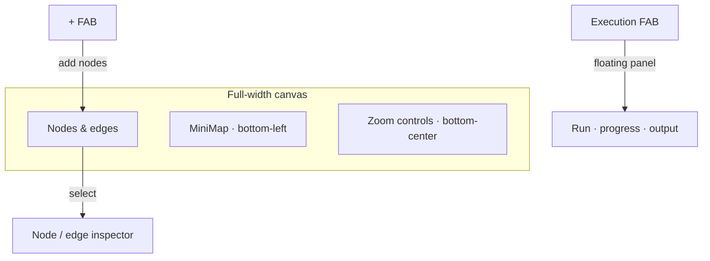

<h1 align="center">
  
  Operate AI
</h1>

<p align="center">
  A visual editor for easily building AI agents and LLM workflows.
  <br> An open space for any agentic flow you envision.
</p>

<p align="center">
  
</p>

## Overview



## Workflow model



| Node | Role |
|------|------|
| **Input** | Text and attachments (`.docx`, `.pdf`, images, …) |
| **LLM** | Ollama call — receives original input + upstream output |
| **Output** | Displays the final result |

Execution order follows the graph (disabled edges are skipped).

## Editor



- **+** — add Input, LLM, or Output nodes  
- **Execution** — run workflow, live progress chain, final output, collapsible node logs  
- **Inspectors** — properties appear next to the selected node or edge  

## Quick start

**Prerequisites:** Node 18+, pnpm, Python 3.11+, [Ollama](https://ollama.com)

```bash
pnpm install
pnpm build:schema

cp .env.example .env
cp apps/web/.env.example apps/web/.env.local
```

```bash
# Ollama (Docker)
docker compose up -d ollama
docker exec -it operate-ai-ollama ollama pull gemma4:e4b

# API + web (separate terminals)
pnpm dev:api
pnpm dev:web
```

Open [http://localhost:3000](http://localhost:3000) → **New Workflow** → edit nodes → **Run**.

| Variable | Default | Purpose |
|----------|---------|---------|
| `OLLAMA_BASE_URL` | `http://localhost:11434` | Ollama API |
| `NEXT_PUBLIC_API_URL` | `/backend` | Web → FastAPI proxy (`:8000`) |

## Stack

| Layer | Tech |
|-------|------|
| Frontend | Next.js, React Flow, Zustand, Tailwind |
| Backend | FastAPI, httpx |
| LLM | Ollama |
| Shared types | `packages/workflow-schema` |

## Repo layout

```
operate-ai/
├── apps/web/                 # Visual editor
├── apps/api/                 # Execution & persistence
├── packages/workflow-schema/ # Shared workflow types
└── docker-compose.yml        # Ollama
```

## Scripts

```bash
pnpm dev:web        # :3000
pnpm dev:api        # :8000
pnpm build:schema   # Shared TS types
pnpm build:web      # Production build
```

## API (summary)

| Method | Path | Description |
|--------|------|-------------|
| `POST` | `/execute/stream` | Run workflow (SSE progress) |
| `POST` | `/execute` | Run workflow (JSON) |
| `GET` | `/models` | List Ollama models |
| `GET/POST` | `/workflows` | List / save workflows |
| `GET/DELETE` | `/workflows/{id}` | Get / delete workflow |
